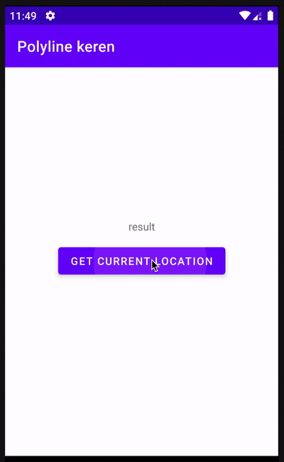
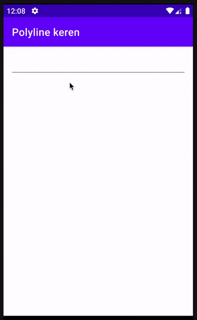
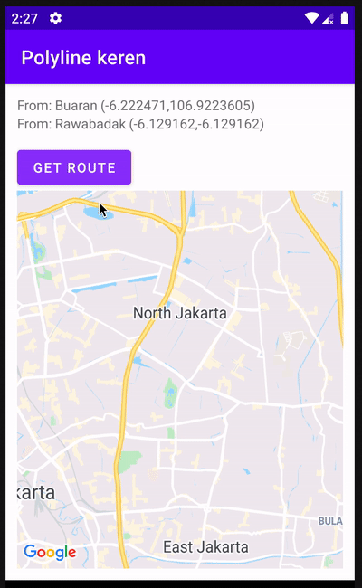
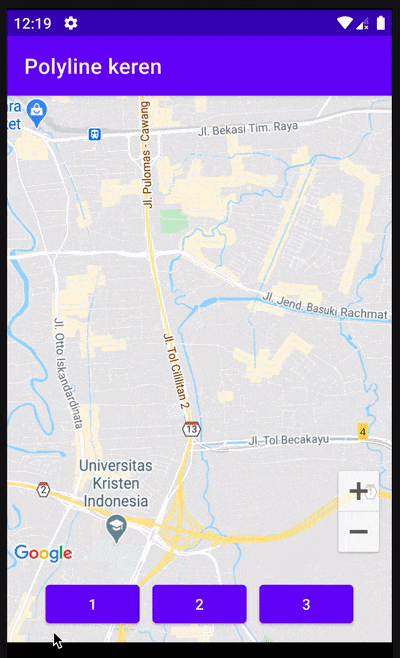

<p align="center">
  <h1 align="center">Geolib</h1>
</p>

<p align="center">
  
</p>

<p align="center">
  <a href="https://bintray.com/kucingapes/utsman/com.utsman.geolib/_latestVersion"></a>
  <a href="LICENSE"></a>
  <a href="https://github.com/utsmannn/geolib/pulls"></a>
  <a href="https://developer.android.com/kotlin"></a>
  <a href="https://twitter.com/utsmannn"></a>
  <a href="https://github.com/utsmannn"></a>
  <h3 align="center">Android helper libraries for geolocation, places and animating polyline</h3>
</p>


## Documentation libraries
- [Location library](location)
- [Routes Library](routes)
- [Polyline-utils for GoogleMaps](polyline-utils)

## Prerequisite
### HERE Api
You need HERE Api, open https://developer.here.com/. Create new account or login and create api key.


### Google dependencies
```groovy
// Google maps if needed
implementation 'com.google.android.gms:play-services-maps:17.0.0'
implementation 'com.google.maps.android:android-maps-utils:0.5'
implementation 'com.google.maps.android:maps-ktx:2.1.1'

// Google play location
implementation 'com.google.android.gms:play-services-location:17.1.0'
```

### Maven repositories (if needed)
````groovy
allprojects {
  repositories {

    // maven url
    maven { url 'https://dl.bintray.com/kucingapes/utsman' }
  }
}
````

### All dependencies
```groovy

// location
implementation 'com.utsman.geolib:location:1.0.0'

// routes
implementation 'com.utsman.geolib:routes:1.0.0'

// polyline utils
implementation 'com.utsman.geolib:polyline:1.0.0'
```

## Screenshot
|Get location|Search location|
|---|---|
|||

|Route|Polyline-utils|
|---|---|
|||


## License
```
Copyright 2021 Muhammad Utsman

Licensed under the Apache License, Version 2.0 (the "License");
you may not use this file except in compliance with the License.
You may obtain a copy of the License at

    http://www.apache.org/licenses/LICENSE-2.0

Unless required by applicable law or agreed to in writing, software
distributed under the License is distributed on an "AS IS" BASIS,
WITHOUT WARRANTIES OR CONDITIONS OF ANY KIND, either express or implied.
See the License for the specific language governing permissions and
limitations under the License.
```
---

